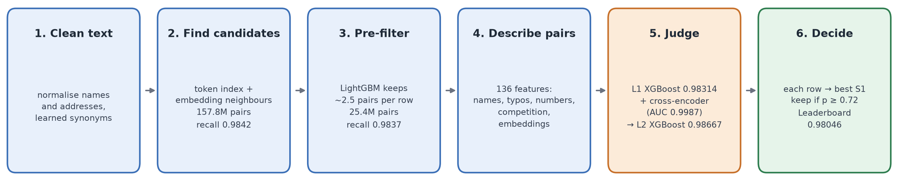

# 1. The problem in plain words

We get three lists of businesses. **Source 1 (S1)** is a clean reference list with one row per
business. **Source 2 and Source 3 (S2/S3)** are messy copies of the same businesses, full of typos,
abbreviations, missing address parts, names written in Hindi / Tamil / other scripts, and extra
businesses that are not in S1 at all.

**Task:** for every S1 business, list the S2/S3 rows that are the same real business.

**Score:** F0.5, computed for each S1 business and then averaged (*macro* F0.5).

- F0.5 cares about **precision twice as much as recall**. A wrong match hurts more than a missed one.
- A business with no true matches (a *singleton*) scores 1 only if we predict nothing for it.

**Countries:** the training data covers the **US and India**. The test data also contains **France**,
which never appears in training.

**Rules:** no external data or APIs, and models must be MIT/Apache licensed with at most 8B
parameters.

# 2. Results at a glance

| Stage | What changed | Leaderboard |
|---|---|---|
| First full pipeline | normalisation, candidate search, 2-level XGBoost | 0.970074 |
| Distractor fix | training data made as "crowded" as test (Section 5, decision 3) | 0.970964 |
| Reproduced on a new Modal account | same pipeline, same result | 0.971078 |
| Recall fixes | embedding-neighbour candidates plus typo features | 0.972 |
| **Cross-encoder** | a fine-tuned multilingual transformer reads both records | **0.98046** |

Our honest internal score is **out-of-fold (OOF)**: each training pair is scored by a model that
never saw it.

- Best OOF macro F0.5: **0.98667**.
- By country: India 0.9835, US 0.9888.

# 3. What the data told us (EDA)

| Fact | Number | Why it mattered |
|---|---|---|
| Size | train: 2.2M S1, 10.3M S2+S3 rows; test: 1.73M S1, ~10M S2+S3 rows | comparing every pair is impossible, so we need a fast candidate search |
| Test countries | India 46.8%, US 38.3%, France 15.0% of S1 | France is unseen, so nothing can depend on the country label |
| Matches per S1 | 3.46 on average; only **5.6%** are singletons | predicting nothing for a business usually scores 0 |
| One-to-one | every S2/S3 row belongs to **at most one** S1 | each row can be given to its single best S1 only |
| Crowdedness | train has 4.68 S2/S3 rows per S1, test 5.75 | test has more look-alike "distractors" than train |
| Scripts | many Indian names are in Indic scripts with short addresses | we need transliteration and a multilingual model |

# 4. The pipeline, step by step

Think of it as a funnel: from ~10M × 2M possible pairs down to a small set of likely pairs, then a
careful judge decides which ones are real.

## Step 1: Clean the text (normalisation)

- **What:** convert every name and address to a comparable form.
  - Lower-case, and convert other scripts to Latin letters.
  - Shorten legal words: "Private Limited" becomes "pvt ltd".
  - Shorten street words: "Street" becomes "st".
  - Pull out house numbers and postal codes.
  - Build a "core name" (legal words removed) and a phonetic key.
- **Learned synonyms:** from 800k training matches, we learned which word swaps really mean the same
  thing. Examples: Hindi "प्राइवेट" (transliterated) → "pvt", "bombay" → "mumbai".
  - A swap needs at least 15 occurrences.
  - It must look like a spelling variant, which blocks bad swaps such as "richmond" → "county".

## Step 2: Find candidates (blocking)

- **Token index:** a search engine over name and address words, weighted by rarity (IDF). Rare
  shared words count more.
  - Searched both ways: each S2/S3 row's top 10 S1, and each S1's top 20 rows.
  - Only within the same country.
- **Embedding neighbours:** a multilingual sentence model (MiniLM) turns each name into a vector.
  Each row also gets its 5 closest S1 names.
  - This finds Hindi-script names and badly typo'd names that share no exact words.
- **Result on train:**

  | Candidate set | Pairs | Recall (share of true matches found) |
  |---|---|---|
  | token index | 114.8M | 0.9809 |
  | + embedding neighbours | 157.8M | **0.9842** |

## Step 3: Pre-filter

- A cheap LightGBM model scores every candidate using a few fast numbers.
- It keeps about **2.5 pairs per row**: 25.4M train pairs (recall still 0.9837) and 24.0M test pairs.
- **Ceiling:** a perfect judge on these pairs would score 0.9946.

## Step 4: Describe each pair (136 features)

| Group | Examples |
|---|---|
| Name similarity | fuzzy ratios, token-sort / token-set, Jaro-Winkler, phonetic match |
| Typo features | same letters in a different order, same words in a different order, initials |
| Script | is one side in Hindi and the other in Latin letters? |
| Word rarity | do they share a rare word? Does one side have a rare word the other lacks? |
| Address and numbers | house number equal or close, postal code, empty address |
| Competition | is this S1 the best option for this row? By how much? What is the runner-up? |
| Embeddings | name-vector similarity and its rank among the row's options |

## Step 5: The judge, a two-level model

- **Level 1:** XGBoost on the GPU, trained on the 136 features.
  - 3 folds split by S1, so every training pair gets an honest OOF score.
  - OOF **0.98314**, AUC 0.99960.
- **Cross-encoder:** our biggest single gain.
  - **What it is:** the multilingual MiniLM model (Apache-2.0, 118M parameters), fine-tuned to read
    `S1 name | S1 address` and `S2/S3 name | S2/S3 address` **together** and output a match
    probability. It never sees the country.
  - **Training:**
    - 2 folds by S1, each fold model trained on 2M pairs from the other fold, 1 epoch.
    - Optimiser: AdamW, lr 5e-5, batch 256, bf16, max 96 tokens.
    - It is only run on the likely pairs: each row's best pre-filter pair plus every pair with
      probability ≥ 0.05. That is 10.7M train and 10.4M test pairs, covering 99.3% of true matches.
  - **Quality on its own:** held-out AUC **0.9987**.
  - **Cost:** about 1.6 h on one H100 GPU. Training runs at about 1,460 pairs/s and scoring at
    about 8,000 pairs/s.
- **Level 2:** XGBoost again, this time also given:
  - Level 1's OOF probabilities, summarised per row and per S1 (the best competitor, the gap, how
    many strong options there are).
  - The cross-encoder's probability, rank and gap.
  - OOF **0.98667**, AUC 0.99975.

## Step 6: Decide the final matches

1. Each S2/S3 row goes only to its **single most likely S1** (the one-to-one rule).
2. A pair is kept only if its probability is **≥ 0.72**. This threshold is tuned on OOF with the
   exact competition metric.

# 5. The key decisions and why we made them

1. **Enforce one-to-one.** The ground truth never gives one row to two businesses, so we don't either.
   This removes a whole class of wrong matches for free.
2. **Tune everything with the exact metric.** We wrote a fast, exact macro-F0.5 calculator that
   includes singletons, and used it for every threshold and rule choice.
3. **Make training as crowded as test.** Test has more distractor rows per business (5.75 vs 4.68).
   We removed 19% of training S1 businesses and kept their rows as unmatched distractors. Thresholds
   learned on train then carry over to test.
4. **Never let the country be a feature.** France is unseen. The country is used only to split the
   search, so everything learned is about text, not about country.
5. **Split data preparation from training.** Every data step is cached, so a model change reruns in
   minutes, not hours.
6. **Use a transformer where hand-made features fail.** Our error analysis (below) showed that
   typos, scripts and word order were the main losses. A cross-encoder reads the raw text and
   learns those patterns directly.
7. **Add the cross-encoder at level 2 only.** Level 1 (1.4 h of training) could be reused from its
   checkpoints, so the new model trained in about 45 minutes instead of about 2 hours.

# 6. How we found what to fix

**Error analysis** (OOF, before the cross-encoder; lost points = 100 × (1 − score)):

| Where points were lost | India | US |
|---|---|---|
| true match never became a candidate | 0.45 | 0.22 |
| true match found but scored below the threshold | 0.27 | 0.46 |
| predicted a row that belongs to no S1 | 0.13 | 0.15 |

**Unseen-country test** (a proxy for France): train on one country, test on the other.

| Test on | Trained on the same country | Trained on the other country |
|---|---|---|
| India | 0.977 | 0.900 (−7.7 points) |
| US | 0.985 | 0.972 (−1.3 points) |

This showed that a new country costs real points, and that picking a better threshold does not help.
That is why we moved to a pretrained multilingual model.

The cross-encoder raised the leaderboard by 0.85 points but OOF by only 0.30, so it helped the test
data (most likely France) the most. From the score arithmetic, France is roughly **0.95** now versus
~0.986 for US+India. This is an estimate, not a measurement.

# 7. What we tried

| Idea | Result | Kept? |
|---|---|---|
| Embedding-neighbour candidates | recall 0.9809 → 0.9842 | yes |
| Typo / character features | part of the 0.971 → 0.972 step | yes |
| Distractor-density matching | 0.970074 → 0.970964 | yes |
| Level-2 stacking | OOF 0.98314 → 0.98367 | yes |
| **Cross-encoder** | OOF 0.98367 → 0.98667, leaderboard 0.972 → 0.98046 | **yes** |
| Per-country thresholds | gain < 0.0003 | no |
| Smarter per-S1 decision rules (two thresholds, expected-F0.5) | +0.0001 on OOF | no |
| Self-training on test (pseudo-labels) | mixed in simulation | no |

# 8. Infrastructure

- **Local laptop (VS Code, Windows):** cheap checks, validation and packaging (`run.py`).
- **Modal cloud:** 32 CPU cores, 128 GB RAM and one GPU (L4 or H100).
  - Jobs are launched server-side (`remote/launch.py`), so closing the laptop never kills a run.
  - Checkpoints are saved every 5 minutes, and fold models are saved as soon as they finish.
- **Typical times:**
  - Embedding neighbours: 1.2 h. Pre-filter: 17 min. Features: 29 min.
  - Level 1: 1.4 h. Cross-encoder: 1.6 h. Level 2 + prediction: 45 min.

# 9. Compliance

- No external data, APIs or geocoding. Every table and synonym is learned from the provided
  training files.
- **Models:**
  - XGBoost (Apache-2.0) and LightGBM (MIT)
  - multilingual MiniLM (Apache-2.0, ~118M parameters, far below the 8B limit)
- **Libraries:** scikit-learn (BSD-3), rapidfuzz (MIT), PyTorch (BSD). Unidecode (GPL-2) is used
  only for text preprocessing, not as a model.

# 10. Glossary

- **Blocking / candidates:** a quick search that picks which pairs are worth comparing.
- **Recall:** the share of true matches we found.
- **Precision:** the share of our matches that are correct.
- **F0.5:** a score mixing precision and recall, with precision weighted more.
- **OOF (out-of-fold):** a score for each training pair from a model that did not train on it. It is
  our honest internal estimate.
- **AUC:** how well a model ranks true pairs above false ones (1.0 = perfect).
- **Cross-encoder:** a transformer that reads two texts at once and outputs how related they are.
- **Stacking (level 2):** a second model that learns from the first model's predictions.
